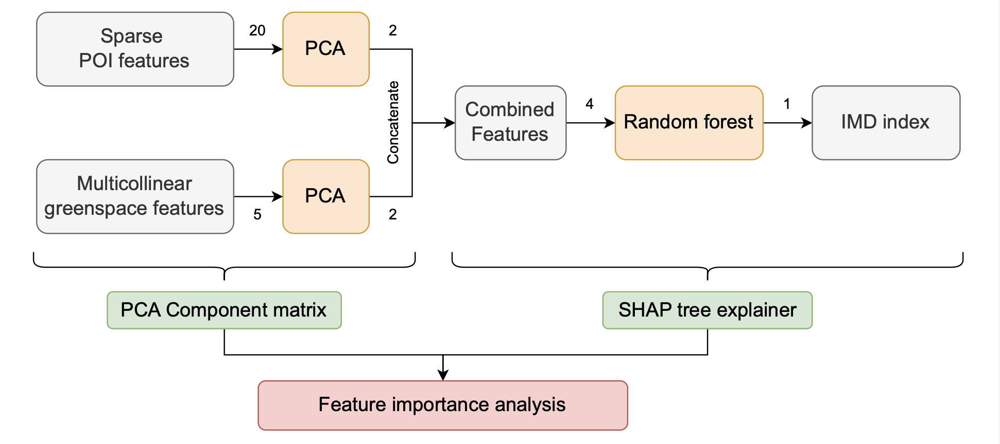
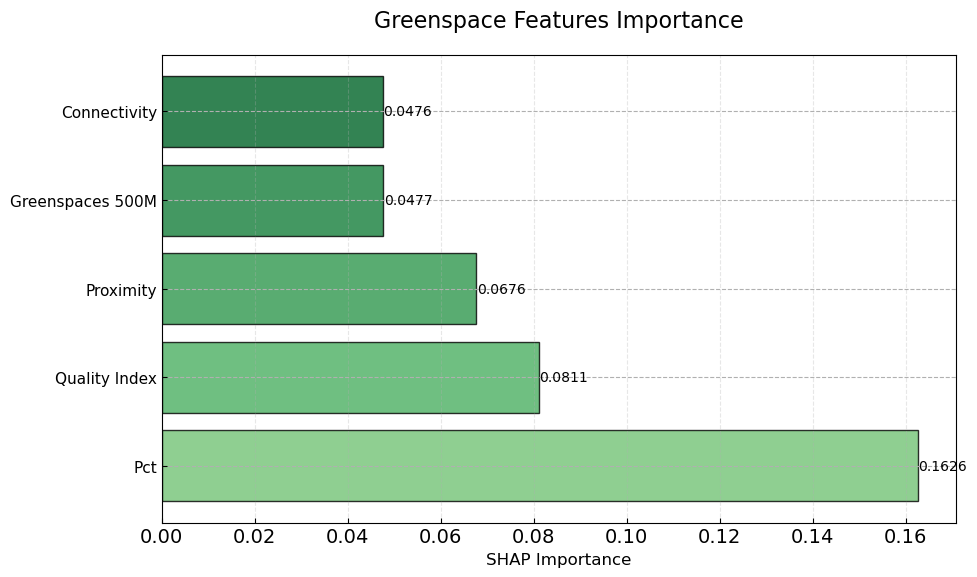
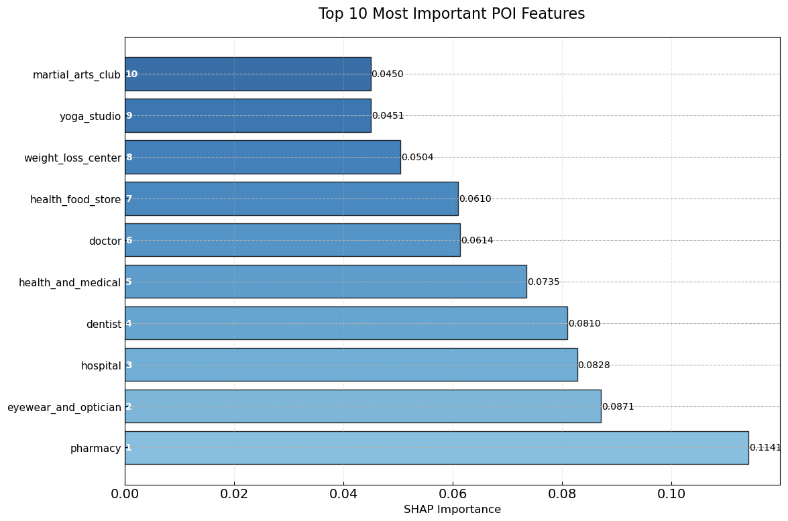

# London Health Inequality Analysis: Integrating Green Space and Healthcare Accessibility

> **Master's Dissertation Project** | Urban Data Science & Analytics | University of Leeds (2025)

A machine learning-driven spatial analysis investigating health disparities across London neighborhoods through integrated environmental and healthcare service modeling.

## 🎯 Project Overview

This project demonstrates advanced spatial data science techniques applied to urban health policy research. Using London's 4,835 Lower Layer Super Output Areas (LSOAs), I developed predictive models explaining **57% of health outcome variance** through integrated analysis of green space quality and healthcare accessibility.

**Key Achievement**: Successfully identified actionable insights for urban planning policy by combining multiple complex datasets and applying interpretable machine learning methods.

## 🔧 Technical Stack

**Programming & Analysis**
- **Python**: pandas, numpy, scikit-learn, geopandas
- **Machine Learning**: Random Forest, Principal Component Analysis (PCA)
- **Model Interpretation**: SHAP (Shapley Additive Explanations)
- **Visualization**: matplotlib, seaborn
- **Spatial Analysis**: Geographic data processing and visualization

**Data Sources & Scale**
- 4,835 London neighborhood areas (LSOA level)
- 50+ green space quality indicators
- 15,000+ healthcare facilities across 10+ categories
- Official UK government datasets (ONS, Ordnance Survey)


## Method overview



This Figure illustrates the analytical pipeline designed to predict health outcomes and identify key determinants of health disparities. This workflow consists of three main steps: 

1. Data preprocessing and dimensionality reduction, where the sparsity of POI features and multicollinearity of green space features are addressed through PCA dimensionality reduction. 

2. Predictive modeling, where a Random Forest model is trained to predict health outcomes using the reduced feature sets. 

3. Feature importance analysis, where SHAP TreeExplainer generates feature importance scores in the reduced space, which are subsequently mapped back to original feature interpretations with PCA component matrices.

 This approach enables comprehensive analysis of both compressed feature relationships and original feature contributions to health outcomes prediction.


## 📊 Key Results & Impact

### Model Performance


- **R² = 0.5677**: Explained 57% of health outcome variance
- **Significant improvement** over single-factor models typically used in urban health research
- Robust cross-validation performance demonstrating model reliability

### Business/Policy Insights




1. **Green space quality** (connectivity, accessibility) predicts health outcomes better than total area




2. **Pharmacy accessibility** emerges as strongest healthcare predictor
3. **Synergistic effects** identified: neighborhoods strong in both domains show lowest health deprivation
4. **Clear geographic patterns** enable targeted intervention strategies

### Actionable Recommendations
- Data-driven policy framework for integrated urban planning
- Evidence-based resource allocation for London boroughs
- Quantifiable metrics for measuring intervention effectiveness

## 🛠️ Technical Implementation

### Data Processing Pipeline
```python
# Analytical workflow demonstration
Raw Data (4,835 areas) 
  → Feature Engineering (50+ indicators)
  → PCA Dimensionality Reduction (20→5 green space, 20→2 healthcare)
  → Random Forest Modeling
  → SHAP Interpretation & Visualization
```

### Key Technical Challenges Solved
- **High-dimensional sparse data**: Applied PCA for effective dimensionality reduction
- **Multicollinearity management**: Systematic feature selection and transformation
- **Model interpretability**: SHAP analysis for stakeholder communication
- **Spatial correlation handling**: Geographic-aware analysis methods

## 📈 Project Highlights

### Research Innovation
- **First integrated analysis** combining green space quality + healthcare accessibility for London
- **Novel methodology** applying SHAP interpretation to urban policy research
- **Scalable framework** applicable to other cities and urban planning contexts

### Professional Skills Demonstrated
- **End-to-end project management**: From research question to policy recommendations
- **Complex data integration**: Multiple government datasets with different schemas
- **Stakeholder communication**: Technical results translated to policy implications
- **Academic rigor**: Literature review, methodology validation, limitation analysis

## 📁 Repository Structure

```
├── 📊 data/                    # Processed datasets ready for analysis
├── 📓 notebooks/               # Complete analysis pipeline
│   └── main.ipynb             # Reproducible workflow
├── 📋 reports/                 # Final outputs and visualizations
│   └── figures/               # Publication-quality charts
└── 📄 Investigation Report    # Full academic dissertation (60+ pages)
```

## 📞 Contact & Additional Information

**Yutong Wang** | Urban Data Science & Analytics, MSc  
University of Leeds | August 2025

📧 Available for discussion about methodology, results, or technical implementation  
💼 Seeking opportunities in data science, urban analytics, and policy research

---

*This repository showcases academic research conducted for Master's dissertation. All analysis code and methodologies are available for review and discussion during interview process.*


